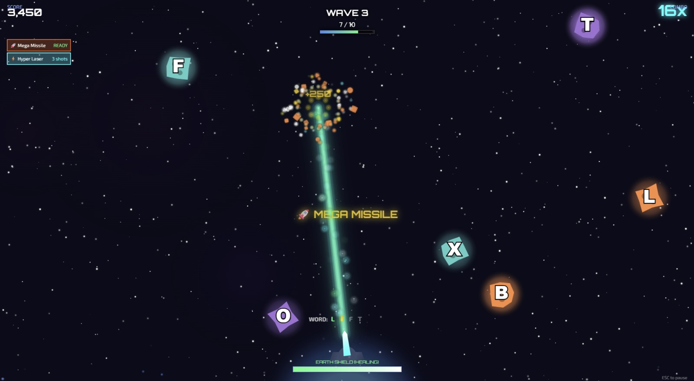

# Cosmic Typer 🚀

A fun, kid-friendly typing game with a space theme. Built for young beginner typists.

**[▶️ Play Now](https://typing.krishvik.com)**

[](https://typing.krishvik.com)


## Features

- 🎮 **Two Game Modes**: Asteroid Defense and Cosmic Runner
- 📖 **Word-Based Typing**: Age-appropriate vocabulary, not random letters
- 🔥 **Combo System**: Power-ups unlock as combos build
- ⭐ **Star Ratings**: Angry Birds-style progression (1-3 stars per level)
- 🎯 **Adaptive Difficulty**: Tracks weak letters and adjusts accordingly
- ✨ **Visual Effects**: Particle explosions, screen shake, parallax backgrounds
- 🔊 **Audio Feedback**: Sound effects and background music

## Quick Start

```bash
# Install dependencies
npm install

# Run development server
npm run dev

# Build for production
npm run build

# Deploy to Cloudflare Pages
npm run deploy:prod
```

## Tech Stack

| Layer | Technology |
|-------|------------|
| Frontend | Vanilla JS + HTML5 Canvas |
| Backend | [Hono](https://hono.dev/) |
| Audio | Web Audio API |
| Hosting | Cloudflare Pages |
| Storage | localStorage |

## Project Structure

```
├── src/
│   └── index.tsx           # Hono app entry point
├── public/static/
│   ├── style.css           # Styles
│   ├── audio/              # Sound effects & music
│   └── game/
│       ├── main.js         # Game controller
│       ├── audio.js        # Audio manager
│       ├── particles.js    # Particle system
│       ├── player.js       # Player profile & progress
│       ├── words.js        # Word dictionary
│       ├── ui.js           # UI components
│       └── levels/
│           ├── asteroid-defense.js
│           └── cosmic-runner/
└── package.json
```

## Game Modes

### Asteroid Defense 🌍
Type letters to shoot falling asteroids before they hit Earth. Complete waves to earn stars.

**Power-ups:**
- 🚀 Mega Missile (5 combo) - AoE blast
- ⚡ Hyper Laser (10 combo) - Instant hit shots  
- 💥 Orbital Strike (15 combo) - Screen clear

### Cosmic Runner 🏃
Type letters to destroy obstacles while running through space. Defeat elite bosses by typing full words.

**Power-ups:**
- ⚡ Rapid Fire (5 combo) - Faster projectiles
- 💥 Explosive (8 combo) - AoE damage
- 🔥 Spread Shot (12 combo) - Multi-target

## Deployment

### Cloudflare Pages (Recommended)

```bash
export CLOUDFLARE_API_TOKEN=your_token
npx wrangler pages deploy dist --project-name your_project_name
```

### AWS S3 + CloudFront

```bash
npm run build:aws
aws s3 sync dist-aws/ s3://YOUR_BUCKET --delete
```

## Contributing

Contributions are welcome! Please feel free to submit a Pull Request.

## License

MIT © [Aditya Kar](https://github.com/adityakar)

---

**Made with ❤️ for young space cadets learning to type!**
